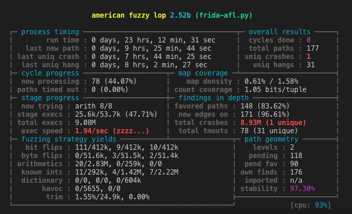

# Frida-AFL



The `frida-afl.py` scripts spawn the target process with ASLR disabled, inject and execute the `afl.js` script and wait for the execution to finish. If you want to use the forkserver implementation you need to pass the `--entrypoint 0xDEADBEEF` option to the `frida-afl.py` script in order for the instrumented code to start the forkserver at the right place. If you dont want to use the forkserver (**which btw currently doesn't work**), just pass `AFL_NO_FORKSRV=1`.

The env-variable `WHITELIST` should be pass in order to instrument also dynamic libraries used by the target. If none is given only the main module (target binary) will be instrumented. If you use `all` as value, every basic block will be instrumented (no matter which module).

For example:
```
WHITELIST="libplist.3.dylib" AFL_NO_FORKSRV=1 frida --no-pause --runtime=v8 -l afl.js -- /usr/local/bin/plistutil -i Info.plist
```
Will only track `libplist` basic blocks.

> **IMPORTANT:** In order to communicate with the forkserver in the target process AFL uses some pipes, those pipes are exposed via FDs when starting the target. Unfortunately this FDs are not inherited from target because of how frida starts the target (and its helper). To address this I created a pull-request in frida-core that fixes the problem: https://github.com/frida/frida-core/pull/279

The `experimental` folder contains some helper files/programs to test forkserver. E.g. `aflmock.c` simulate AFL by setting up the shared memory (code-coverage map), by faking the control pipes like AFL does, by running the target binary via `execv` and by creating a readable memory map file once the execution is finished.

## References
* [Frida Javascript API References](https://www.frida.re/docs/javascript-api/)
* [Frida CModule explanations](https://www.frida.re/news/2019/09/18/frida-12-7-released/)
* [frida-gum CModule](https://github.com/frida/frida-gum/tree/master/bindings/gumjs/runtime/cmodule)
* [AFL-Dynamorio](https://github.com/vanhauser-thc/afl-dynamorio) by Vanhauser
* [AFL forkserver concept](https://lcamtuf.blogspot.com/2014/10/fuzzing-binaries-without-execve.html)
* [Inside a Mach-O binary](https://adrummond.net/posts/macho)
* [posix_spawn part for Mac OS X](https://github.com/frida/frida-core/blob/5328de88a29222559fb2883be54ccae3b705a8b6/src/darwin/frida-helper-backend-glue.m)

## Example Runs

### afl-fuzz
```
$ AFL_NO_FORKSRV=1 WHITELIST="all" AFL_SKIP_BIN_CHECK=1 afl-fuzz -m 800 -i in_file/ -o out/ -t 2000 -- ./frida-afl.py /usr/bin/file @@
afl-fuzz 2.56b by <lcamtuf@google.com>
[+] You have 4 CPU cores and 3 runnable tasks (utilization: 75%).
[+] Try parallel jobs - see /usr/local/share/doc/afl/parallel_fuzzing.txt.
[*] Setting up output directories...
[+] Output directory exists but deemed OK to reuse.
[*] Deleting old session data...
[+] Output dir cleanup successful.
[*] Scanning 'in_file/'...
[+] No auto-generated dictionary tokens to reuse.
[*] Creating hard links for all input files...
[*] Validating target binary...
[*] Attempting dry run with 'id:000000,orig:simple' ...
```

### afl-showmap

```
$ AFL_NO_FORKSRV=1 WHITELIST="file" AFL_SKIP_BIN_CHECK=1 afl-showmap -o map.txt -- ./frida-afl.py /usr/bin/file in_file/simple
afl-showmap 2.56b by <lcamtuf@google.com>
[*] Executing './frida-afl.py'...

-- Program output begins --
__AFL_SHM_ID is 917507
Spawning /usr/bin/file in_file/simple
[*] Found export for getenv!
[*] Prepared native function @ 0x7fff70bcb85f
[*] Shared memory ID: 917507
[*] Forkserver enabled: false
[*] Whitelist:  file
[*] getpid() found
[*] trace_bits mapped at 0x100561000
[*] Done stalking threads
in_file/simple: Mach-O 64-bit executable x86_64
[*] Monitored 803 blocks!
[*] Shared memory unmapped!
Exiting!
-- Program output ends --
[+] Captured 779 tuples in 'map.txt'.
bash-3.2$ head map.txt
000201:1
000222:1
000984:1
001009:1
001027:1
001047:1
001050:1
001087:1
001122:2
...
```
